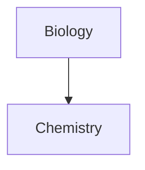

## Basic Formatting

### Headings

```
# H1
## H2
### H3
#### H4
##### H5
###### H6
```

# H1

## H2

### H3

#### H4

##### H5

###### H6

### Emphasis

```md
*Italic*  or  _Italic_
**Bold**
***Bold Italic***  or  _**Bold Italic**_
~~Strikethrough~~
==Highlight==
[[example|Custom Link Text]] → Custom link text
- Bullet Points
- [x] Checklist
```

_Italic_ or _Italic_
**Bold** 
_**Bold Italic**_ or _**Bold Italic**_
~~Strikethrough~~
==Highlight==
[[example|Custom Link Text]] → Custom link text
- Bullet Points
- [x] Checklist
- [x]  Task completed
- [ ]  Task not completed

#### Lists
- Unordered:
    - Item 1
    - Item 2
- Ordered:
    1. Item 1
    2. Item 2

### Colors

```
<font color="#cc241d"> Red Hexkode</font>
<font color="#ffbe0b"> Yellow Hexkode</font>
<font color="#fb5607"> Orange Hexkode</font>
<font color="#ff006e"> Pink Red Hexkode</font>
<font color="#9d4edd"> Purple Hexkode</font>
<font color="#3a86ff"> Blue Hexkode</font>
<font color="#8ac926"> Lime green Hexkode</font>

<font color= "crimson"> Red Hexkode</font> 
<font color="gold"> Yellow Hexkode</font> 
<font color="orangered"> Orange Hexkode</font> 
<font color="deepPink"> Pink Red Hexkode</font> 
<font color="blueviolet"> Purple Hexkode</font> 
<font color="cornflowerblue"> Blue Hexkode</font> 
<font color="limegreen"> Lime green Hexkode</font>
```
<font color="#cc241d"> Red Hexkode</font>
<font color="#ffbe0b"> Yellow Hexkode</font>
<font color="#fb5607"> Orange Hexkode</font>
<font color="#ff006e"> Pink Red Hexkode</font>
<font color="#9d4edd"> Purple Hexkode</font>
<font color="#3a86ff"> Blue Hexkode</font>
<font color="#8ac926"> Lime green Hexkode</font>

<font color= "crimson"> Red Hexkode</font> 
<font color="gold"> Yellow Hexkode</font> 
<font color="orangered"> Orange Hexkode</font> 
<font color="deepPink"> Pink Red Hexkode</font> 
<font color="blueviolet"> Purple Hexkode</font> 
<font color="cornflowerblue"> Blue Hexkode</font> 
<font color="limegreen"> Lime green Hexkode</font>
### Blockquotes

```md
> This is a blockquote.
```

> This is a blockquote.

### Horizontal Rule / Separator

```md
---
```

---

### Links

```md
[Link text](https://example.com/)
```

[Link text](https://example.com/)

### Images

```md

```


### Inline Code & Code Blocks

```md
`Inline code`
```

`Inline code`

````md
```language
Code block here
````

````

```language
Code block here
````

### Footnotes

```md
This is a footnote reference[^1]

[^1]: This is the footnote text.
```

This is a footnote reference[1](https://chatgpt.com/c/67a341b6-4cc0-8007-83a2-bbf5b81ed9dd#user-content-fn-1)

### Callouts

```md
> [!note] Note Title
> This is a note.

> [!tip] Tip Title
> This is a tip.

> [!warning] Warning Title
> This is a warning.

> [!caution] Caution Title
> This is a caution.

> [!important] Important Title
> This is important.
```

### Callouts

Note
> [!note]-
> ```md
> [!note]
> Lorem ipsum dolor sit amet
> Aliases: `summary`, `tldr`

Abstract
> [!abstract]-
> ```md
> [!abstract]
> Lorem ipsum dolor sit amet
> Aliases: `summary`, `tldr`

Info
> [!info]-
> ```md
> [!info]
> Lorem ipsum dolor sit amet

Tip
> [!tip]-
> ```md
> [!tip]
> Lorem ipsum dolor sit amet
> Aliases: hint, important

Question
> [!question]-
> ```md
> [!question]
> Lorem ipsum dolor sit amet
> Aliases: help, faq

Warning
> [!warning]-
> ```md
> [!warning]
> Lorem ipsum dolor sit amet
> Aliases: caution, attention

Failure
> [!failure]-
> ```md
> [!failure]
> Lorem ipsum dolor sit amet
> Aliases: fail, missing

Danger
> [!danger]-
> ```md
> [!danger]
> Lorem ipsum dolor sit amet
> Alias: error

Bug
> [!bug]-
> ```md
> [!bug]
> Lorem ipsum dolor sit amet

Example
> [!example]-
> ```md
> [!example]
> Lorem ipsum dolor sit amet

Quote
> [!quote]-
> ```md
> [!quote]
> Lorem ipsum dolor sit amet
> Alias: cite


```


Aliases: `summary`, `tldr`

> [!note] Note Title This is a note.

> [!tip] Tip Title This is a tip.

> [!warning] Warning Title This is a warning.

> [!caution] Caution Title This is a caution.

> [!important] Important Title This is important.

### Checklists

```md
- [x] Task completed
- [ ] Task not completed
```
### Tables

```md
| Header 1 | Header 2 | Header 3 |
| -------- | -------- | -------- |
| Cell 1   | Cell 2   | Cell 3   |
| Cell 4   | Cell 5   | Cell 6   |
```

|Header 1|Header 2|Header 3|
|---|---|---|
|Cell 1|Cell 2|Cell 3|
|Cell 4|Cell 5|Cell 6|

---

## Lists

### Unordered

```md
- Item 1
  - Subitem 1
  - Subitem 2
- Item 2
```

- Item 1
    - Subitem 1
    - Subitem 2
- Item 2

### Ordered

```md
1. Item 1
2. Item 2
```

1. Item 1
2. Item 2

---

## Hotkeys & Shortcuts

### Notes:

- `#` = Win (Windows key)
- `!` = Alt
- `^` = Ctrl
- `-` = Shift

### Formatting Hotkeys

```md
==Highlight== → Double equals
**Bold** → Double asterisks
_Italic_ → Single asterisk

```

==Highlight== → Double equals **Bold** → Double asterisks _Italic_ → Single asterisk [[example|Custom Link Text]] → Custom link text

### Math Notation (MathJax)

```md
$ E = mc^2 $ (Inline)
$$
E = mc^2
$$ (Block)
```

$ E = mc^2 $ (Inline)

E = mc^2 $$ (Block)

## Footnotes

1. This is the footnote text. [↩](https://chatgpt.com/c/67a341b6-4cc0-8007-83a2-bbf5b81ed9dd#user-content-fnref-1)

